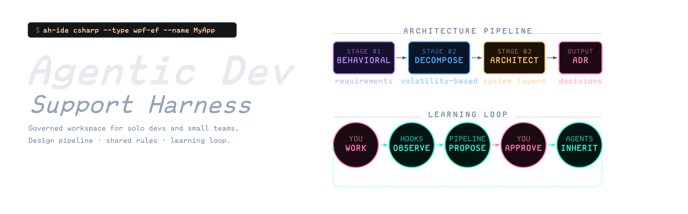
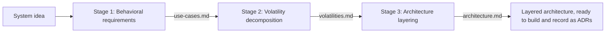
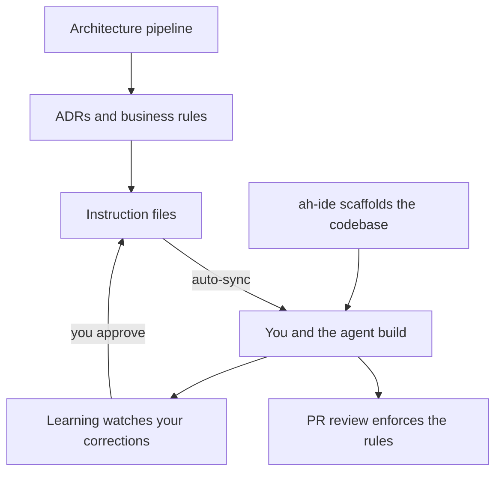
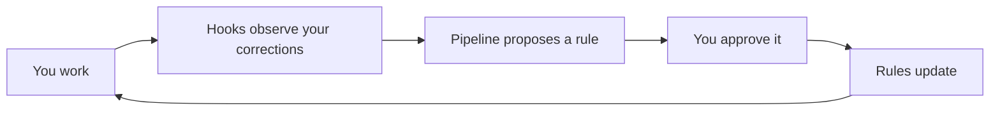

<div align="center">
  
</div>

# Agentic Dev Support Harness

A repository template that gives GitHub Copilot and Claude Code one shared rulebook, so both agents behave consistently inside the same codebase. Drop it on an empty directory and you get a governed agent workspace: a structured way to design systems, a single source of truth for agent rules, decision and review workflows, a stack scaffolder, and a learning loop that turns your corrections into rules.

This README is the map: a high-level overview that links into each system's own README for the detail. Setup and every tool run as one Python command (start with `python .github/scripts/setup/repository-setup.py`); the git pre-commit hook is the only shell script in the template.

## What it does best: the architecture design pipeline

The harness will sync rules and mine your corrections, but its strongest capability is turning a fuzzy system idea into a layered, named architecture you can build from. Three skills run in order over one shared `docs/design/{slug}/` folder, each reading the previous stage's artifact and writing its own. The method is volatility-based decomposition (Juval Löwy's IDesign), not functional decomposition.



The three skills are `behavioral-requirements` (requirements as required behavior, not solutions in disguise), `volatility-decomposition` (what is likely to change, and the boundaries that encapsulate it), and `architecture-layering` (classify into Client / Business Logic / ResourceAccess / Resource with the Manager/Engine/ResourceAccess taxonomy). Each also runs standalone and a run can stop after any stage, so a `{slug}` folder may hold one to three artifacts. The artifacts are ephemeral; once a design settles, promote the durable decisions into ADRs.

- Start the full run: ask the agent to "run the architecture design pipeline."
- Stage skills and conventions: [`.github/skills/README.md`](.github/skills/README.md)
- Artifact layout and lifecycle: [`docs/design/README.md`](docs/design/README.md)
- Why it is organized this way: [`docs/adr/adr-design-establish-architecture-design-pipeline.md`](docs/adr/adr-design-establish-architecture-design-pipeline.md)

## How the systems fit together

The pipeline produces a design. ADRs record the decisions that design depends on. Instruction files turn those decisions into rules both agents load automatically. PR review enforces the rules. The learning loop watches what you correct and proposes the next rule. Scaffolding gives you a codebase to apply all of it to.



Everything is a reviewable file in git, not hidden state: designs, ADRs, rules, and proposals are all plain markdown you can read and diff.

## README index

| System | What it covers | README |
|--------|----------------|--------|
| Architecture & design | The three-stage pipeline's working artifacts | [`docs/design/README.md`](docs/design/README.md) |
| Decision records | When and how to write ADRs | [`docs/adr/README.md`](docs/adr/README.md) |
| Business rules | Constraints the business owns, not engineering | [`docs/business-rules/README.md`](docs/business-rules/README.md) |
| Instruction files | The rules both agents load, scoped by file type | [`.github/instructions/README.md`](.github/instructions/README.md) |
| Skills | On-demand procedures the agent runs by name | [`.github/skills/README.md`](.github/skills/README.md) |
| Reference docs | Templates, companion guides, system index | [`.github/docs/README.md`](.github/docs/README.md) |
| Scripts | Sync, validation, scaffolder, setup, eject, pipeline | [`.github/scripts/README.md`](.github/scripts/README.md) |
| Learning pipeline | Corrections to proposed rules, in depth | [`.github/scripts/learning/README.md`](.github/scripts/learning/README.md) |
| Git hooks | Pre-commit sync and validation | [`.github/hooks/README.md`](.github/hooks/README.md) |
| Scaffolding templates | The `ah-ide` CLI and its stack templates | [`templates/README.md`](templates/README.md) |
| Teardown | What a finished project sheds from the template, via harness-eject | [`.github/scripts/README.md`](.github/scripts/README.md) |
| Claude runtime | The synced mirror and local learning data | [`.claude/README.md`](.claude/README.md) |

## System overviews

### Decisions: ADRs and business rules

An ADR records an engineering decision at the moment it is made: a new pattern, a cross-cutting concern, a third-party dependency, or a deviation from convention. A business rule records a constraint the business owns, like a tax threshold or eligibility criterion. The test: if you would call the CTO it is an ADR, if you would call the head of finance it is a business rule. Both have templates and validation, and both auto-load their review rules when you edit files in their directories. Write one with the `adr-creation` or `create-business-rule` skill. Detail: [`docs/adr/README.md`](docs/adr/README.md), [`docs/business-rules/README.md`](docs/business-rules/README.md).

### Rules: instruction files and the sync mirror

Instruction files in `.github/instructions/` are the single source of truth. Copilot reads them directly; Claude reads a synced mirror in `.claude/rules/` plus `CLAUDE.md`. Each file declares its scope with `applyTo` frontmatter, so rules load only for matching file types, and each is hard-capped at 4,000 characters to budget agent context. You edit only the source; `sync-claude-rules.py` regenerates the mirror on every commit. Never hand-edit the mirror. Detail: [`.github/instructions/README.md`](.github/instructions/README.md), [`.claude/README.md`](.claude/README.md).

### Skills: on-demand procedures

Skills cost zero context until invoked. The catalog covers the design pipeline (the three stages plus the orchestrator), `adr-creation` and `create-business-rule`, `project-setup`, `convention-discovery`, `system-review`, `continuous-learning`, and `sequence-diagram`. The agent matches the skill's description against your request and runs it. Detail: [`.github/skills/README.md`](.github/skills/README.md).

### Scaffolding: the ah-ide CLI

The `ah-ide` scaffolder builds a base solution next to the agent assets so the code sits under the synced rules, invoked as `python .github/scripts/scaffold.py`. Stacks are data, not code: each template is a directory with a `manifest.json`. Today that includes C# class library, WPF + DI, and WPF + DI + EF Core, plus a Lua WoW addon. Every scaffold writes a receipt, and `python .github/scripts/scaffold.py undo` reverses the most recent one. Detail: [`templates/README.md`](templates/README.md), engine in [`.github/scripts/README.md`](.github/scripts/README.md).

### Teardown: harness-eject

Once your project has run `project-setup`, the template still carries machinery that exists only to instantiate it: the one-time setup engine, the scaffolder and its templates, and the harness's own decision and process history. `harness-eject` reads a manifest that sorts every removable path into three groups: setup (removed), the scaffolder (removed unless you keep it), and template-authored content (reset to your project). Two guards keep it safe: it refuses to run in the template source, and it never touches the governance layer. Today it runs read-only (`python .github/scripts/eject.py --list` and `--check`); the destructive run is staged for a later phase. Detail: [`.github/scripts/README.md`](.github/scripts/README.md), decision: [`docs/adr/adr-setup-introduce-harness-eject.md`](docs/adr/adr-setup-introduce-harness-eject.md).

### Review: a fixed comment format

Ask the agent to review a diff and it works in priority order: ADR compliance first, then security, correctness, architecture, testing, and style. Comments use an explicit Severity/Category format (for example, `**Blocker/Bug**:`). Detail: [`.github/docs/README.md`](.github/docs/README.md) (see the `pr-review-guide`).

### Learning: corrections become rules

The harness watches how the agent works and turns repeated corrections into proposed rules you approve once. Hooks observe each session, the pipeline aggregates recurring shapes into instincts, and high-confidence instincts become proposals naming a specific instruction file and edit. You review them with the `continuous-learning` skill. This is the only sanctioned way instruction files change: agents never edit them directly, and staleness is evidence-based, not wall-clock. Observations are local per developer; only the curated proposals and memory digest are committed. Detail: [`.github/scripts/learning/README.md`](.github/scripts/learning/README.md), depth in [`.github/docs/learning-system-guide.md`](.github/docs/learning-system-guide.md).



### Automation: hooks, scripts, and CI

A pre-commit hook runs the sync and the system validator on every commit and rejects the commit on any failure, typically in under two seconds. `validate-system.py` confirms the mirror is in sync, frontmatter parses, character limits hold, and cross-references resolve. CI fails PRs with invalid frontmatter or oversized files, and weekly Actions surface unreviewed proposals and mined conventions. Detail: [`.github/hooks/README.md`](.github/hooks/README.md), [`.github/scripts/README.md`](.github/scripts/README.md).

## Quick start

Prerequisites: git, Python 3.10+.

```
# 1. Use this template on GitHub, then clone it
git clone <your-new-repo-url> && cd <your-new-repo>

# 2. Run setup (configures hooks, syncs rules, validates). Setup runs only
#    Python inside this repository and changes nothing on your machine outside it.
python .github/scripts/setup/repository-setup.py

# 3. Scaffold your solution
python .github/scripts/scaffold.py csharp --type wpf-ef --name MyApp   # see templates/README.md

# 4. Tailor instruction files to your stack, then commit
# Run the project-setup skill in your editor, then:
git add -A && git commit -m "chore: initialize from harness template"
```

Setup also scaffolds into a bare empty directory: `python .github/scripts/setup/repository-setup.py /path/to/new-project` inits git there and copies the template. After setup, the `project-setup` skill walks the `<!-- CUSTOMIZE -->` markers and generates a `{language}-code-standards.instructions.md` for your stack. Re-run validation any time with `python .github/scripts/validate-system.py`.

## Layout

The directories you will actually touch:

- `.github/instructions/`: the rules, scoped by frontmatter (source of truth)
- `.github/skills/`: on-demand procedures the agent invokes by name
- `.github/docs/`: templates, companion guides, and the [system index](.github/docs/system-index.md) (full file map)
- `docs/adr/`, `docs/business-rules/`, `docs/design/`: your decisions and designs
- `.claude/rules/` and `CLAUDE.md`: synced mirrors, never edit by hand
- `.claude/learning/`: local per-developer learning data

## Design notes

The harness budgets agent context deliberately: rules load only for matching file types, every instruction file is hard-capped at 4,000 characters, dense topics split into a lean rule plus an on-demand guide, and skills cost zero tokens until invoked. Rationale: [context efficiency guide](.github/docs/context-efficiency-guide.md). A committed project-memory digest loads on turn one of every session so the agent starts oriented. Current implementation status, including open verification windows: [docs/process/status.md](docs/process/status.md).
